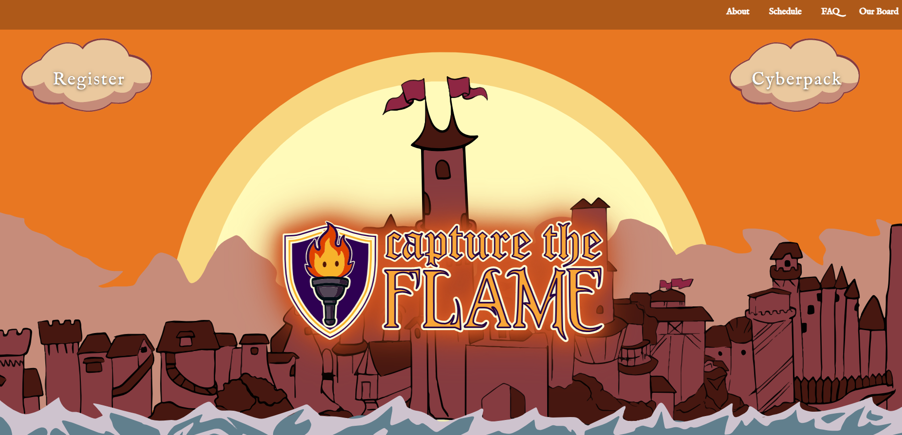
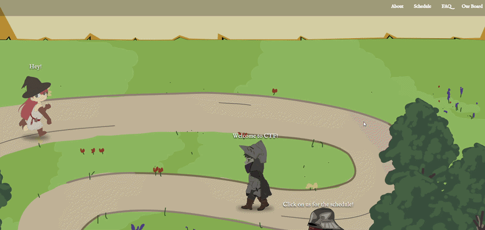
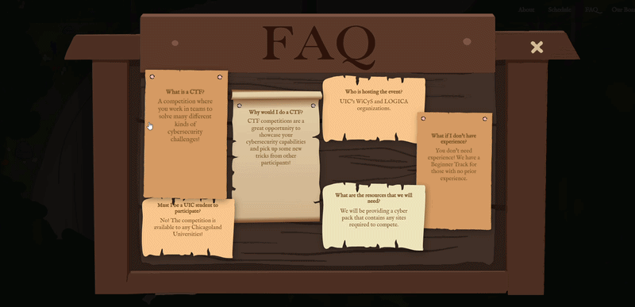
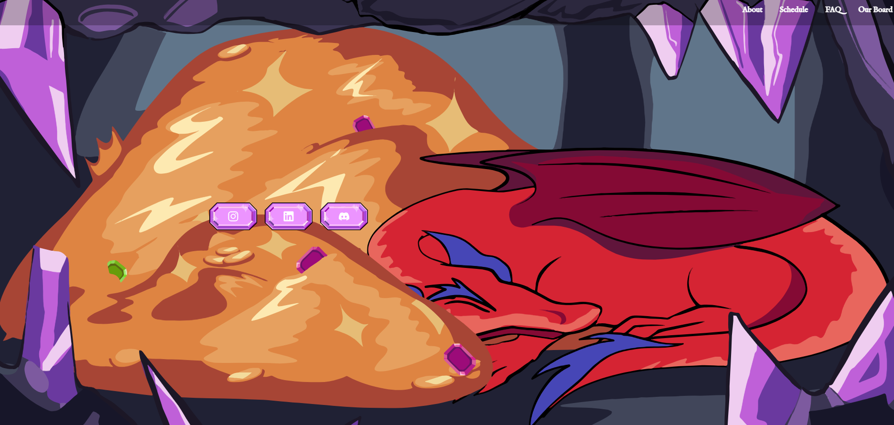

---

Welcome to the **Capture the Flame 2026** Website source code. Capture the Flame 2026 was the second interation of our annual Capture the Flame competition, introducing new cybersecurity topics to over **225** registered competitors. 

Our CTF website was built entirely with **React** to showcase the team's eye for design and express our creativity. Being built and refined for six months, the team worked through a vigorious schedule to deliver a polished and impressive interface. 

This platform served as the central hub for our board to share essantial information, including the competitior shcedule, event details, and team introductions. With custom made art assets, we created an **immersive UI** that reflected the spirit of the competition.

 Schedule 

 FAQ 

## Contibutors

  
<b>Martha Barraza</b> – Team Lead

  &nbsp;&nbsp;&nbsp;&nbsp;
  LinkedIn: 
  <a href="https://www.linkedin.com/in/martha-barraza/" style=" text-decoration: none;">
    Here
  </a>
  &nbsp;&nbsp;&nbsp;&nbsp;
  Github:
  <a href="https://github.com/marthabar" style="text-decoration: none;">
    Here
  </a>

  
Aashika Lilaramani

    &nbsp;&nbsp;&nbsp;&nbsp;
  LinkedIn: 
  <a href="https://www.linkedin.com/in/aashika-lilaramani-61b112207/" style=" text-decoration: none;">
    Here
  </a>
  &nbsp;&nbsp;&nbsp;&nbsp;
  Github:
  <a href="https://github.com/AashiLila" style="text-decoration: none;">
    Here
  </a>

  
Aye Kyawt Zin

    &nbsp;&nbsp;&nbsp;&nbsp;
  LinkedIn: 
  <a href="https://www.linkedin.com/in/ayekyawtzin/" style=" text-decoration: none;">
    Here
  </a>
  &nbsp;&nbsp;&nbsp;&nbsp;
  Github:
  <a href="https://github.com/akzin12" style="text-decoration: none;">
    Here
  </a>

  
Dylan Nguyen

    &nbsp;&nbsp;&nbsp;&nbsp;
  LinkedIn: 
  <a href="https://www.linkedin.com/in/dylngu4915/" style=" text-decoration: none;">
    Here
  </a>
  &nbsp;&nbsp;&nbsp;&nbsp;
  Github:
  <a href="https://github.com/dyl4915" style="text-decoration: none;">
    Here
  </a>

  
Teegan Springer

    &nbsp;&nbsp;&nbsp;&nbsp;
  LinkedIn: 
  <a href="https://www.linkedin.com/in/teegan-springer/" style=" text-decoration: none;">
    Here
  </a>
  &nbsp;&nbsp;&nbsp;&nbsp;
  Github:
  <a href="https://github.com/v1rul3nce" style="text-decoration: none;">
    Here
  </a>

--- 

